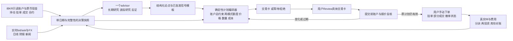

# Trading Agent：源码研究结论与建议设计

研究日期：2026-10-03。本地源码基线：`a20da36ae486160cb8acd47fdb7fe25714a6e0cf`。状态：**实施前的历史设计稿**，下文状态保留该基线；当前交付见[实现记录](trading-skill-implementation-2026-10-03.md)。本文件不含个人账户金额、持仓数量、成交成本、账户标识或密钥。

## 1. 直接结论

**最适合已确认需求的方案，是在当前 Trading Copilot 上增加一个面向用户的投资 advisor：AI 负责研究与候选发现，确定性核心负责价格、数量、资金与风险；长期、波段使用两本逻辑账，共享一个真实 IBKR 账户。用户继续手动交易。**

这是基于需求和源码接口的适配判断，不是「全市场收益最高」的实证结论。当前公开证据不能确定哪一个 GitHub Agent 会在这个账户上持续赚钱，也不能保证任何方案盈利。以净总回报、可承受风险、可复核执行和与基准比较作为目标；机会或数据不足时允许不交易。

已经确认：IBKR；美股 ETF 与主动发现的个股；数日到数周、允许隔夜的波段；长期为主、波段单独限额；长期按总回报评价、分派可再投资；Agent 提建议，用户 Review 后手动下单；账户报告金额是总资产口径，不能作为可用现金。实际原币现金、账户类型、行情权限与风险额度仍需取得。

研究分为四份，可沿证据逐层复核：

- [LLM 框架、估值与论文](trading-agent-llm-landscape-2026-10-03.md)
- [执行框架、IBKR 与行情权限](trading-agent-execution-landscape-2026-10-03.md)
- [当前项目差距、接口与验证](trading-agent-local-gap-2026-10-03.md)
- 本报告：总体取舍及另两份固定源码快照。

## 2. 研究范围与证据等级

检索覆盖官方 GitHub 项目、作者论文与 benchmark、券商及发行方文档；GitHub repository search 用于发现候选，热度不用于判定收益。重点包括 TradingAgents、FinRobot、ai-hedge-fund、Vibe-Trading、AI-Trader、NautilusTrader、Lumibot；补充 TradingAgents-CN、FinMem、FinAgent、LEAN、OpenBB、Qlib、FinRL、vectorbt、StockBench、LiveTradeBench 和 2026 年的新评测。无法诚实声称扫描了全网所有项目。

七个重点项目取回了固定提交的完整主仓库工作树，合计 11,132 个 tracked entries；全文范围检索后重点阅读账户、行情、研究输出、定价、资金分配、成交、回测及相关测试。**完整树不等于逐行读过每个文件，也不等于下载了全部递归子模块、数据集、LFS 文件或模型。** 例如 FinRobot 的子模块范围见分报告。外部仓库仅作为文本静态审阅，没有安装依赖、执行上游代码或运行其测试。

| 仓库 | 固定完整 SHA | 主仓库 tracked entries |
|---|---|---:|
| TradingAgents | `8b22d43d01d9ddda5d686d093d5385884622f3de` | 204 |
| FinRobot | `2717499b8e30f242640af08c4ad9afd1113c2d45` | 1049 |
| ai-hedge-fund | `78b779c1389e2d1452dc29606d2c4126d859b964` | 115 |
| Vibe-Trading | `f21aa13d90558299009a1c5351bf805d51803550` | 2648 |
| AI-Trader | `d03ff6c056b32ced735adf7c19ed8175adb1c8df` | 149 |
| NautilusTrader | `6f3a91818174bbaafcfc8306e38a476c48e032d4` | 5026 |
| Lumibot | `fc05c8ed32cf77336b7405609a42f05759c43634` | 1941 |

证据分级：**S** 为固定源码及测试的静态事实，**P** 为官方文档或作者论文声明，**I** 为适配推论。源码证明实现存在；测试文件证明测试意图；论文是作者在给定实验下的结果。三者都不能替代本账户连接验收、外部项目测试运行或真实投资绩效验证。

## 3. 最值得借鉴的组合

| 候选 | 值得借鉴的能力 | 不能直接沿用的部分 | 本需求取舍 |
|---|---|---|---|
| TradingAgents | 持仓上下文、财报/新闻/技术研究、PIT 数据保护、反方论据 | entry/stop 可以由模型填；sizing 仍为文字；backtest 是 decision quality 而非现金账户净收益 | 研究结构参考 |
| ai-hedge-fund v2.5.0 | 两种策略净额聚合、一个物理 book、代码算 delta shares、持续纸账户与对账 | 模拟 close 全量成交；未建模真实佣金/滑点；没有核实显式 ETF 分派再投资；目标中遗漏持仓意味着零目标 | 双模式组合计算参考，另建实际归属与成本 |
| FinRobot 当前 desktop | 确定性估值覆盖模型文字、币种与数字审计、估值假设敏感性 | 估值 target 不是当前可下单 limit；部分估值带为 placeholder；不能据此得到用户可负担股数 | 长期研究的数值边界参考 |
| Vibe-Trading | 只读组合摘要、数据完整性、不可由 Agent 改写的 mandate、数字 provenance | IBKR 默认请求 delayed；返回 requested/applied tier 而非实际 received type；proposed price 的范围锚定不等于策略验证 | 对话/证据/只读边界参考，重建可执行报价合同 |
| AI-Trader | 服务端覆盖客户端交易价、模拟账本事务、持续复盘 | 所检路径是模拟 balance/position；固定 0.1% 费用；不是 IBKR 成交凭证 | 模拟评估参考，非真实资金权威 |
| NautilusTrader | 账户请求结束边界、bid/ask 模型、外部状态对账、重复成交处理 | 完整自动执行运行时及 rc 依赖；字段存在不证明用户权限和市场时效 | 借状态与去重模式，暂不迁入全栈 |
| Lumibot | 容易阅读的 broker/strategy 接口、持仓更新中发生 fill 的处理 | IBKR 适配器的 BASE 总现金不等于 USD 购买余额，报价 timestamp 是构造 Quote 时的本地生成时间；strategy filter 不隔离真实现金 | 辅助源码参考 |

前三项的固定源码与限制见 [LLM 分报告](trading-agent-llm-landscape-2026-10-03.md)，执行两项见 [执行分报告](trading-agent-execution-landscape-2026-10-03.md)。这是用途排序，没有使用 Stars、persona 数量或回测宣传为盈利打分。

补充候选也有用途边界：LEAN 是完整回测/自动部署引擎；OpenBB 是可选研究数据层，当前 V5 有破坏性迁移；Qlib/FinRL 适合后续 ML/RL 实验；vectorbt 适合快速离线敏感性模拟。它们不自动解决当前账户事实、手动成交与双模式归属。[官方资料与版本边界](trading-agent-execution-landscape-2026-10-03.md)

TradingAgents-CN 当前默认分支社区版已转为 A 股研究助手，README 明写不提供目标价、止损止盈或买卖时机；其应用层为专有 source-available 混合授权。这是当前官方 README 核验，未取得该项目完整固定源码，不应沿用旧文章中的美股交易能力印象。[官方当前 README](https://github.com/hsliuping/TradingAgents-CN)

### Vibe-Trading：本轮另外核实的固定源码

完整快照路径位于系统 Temp 的 `trading-agent-research-2026-10-03/Vibe-Trading`；HEAD 提交时间为 2026-10-02T16:14:41+08:00，MIT。静态核对 portfolio service/tool/tests、IBKR connector、mandate、advisory、grounding、order guard 及 SDK gate；工作树干净。

- [PortfolioSummaryTool L1–48](https://github.com/HKUDS/Vibe-Trading/blob/f21aa13d90558299009a1c5351bf805d51803550/agent/src/tools/portfolio_tool.py#L1-L48) 是只读、清洗后的账户组合入口；[service L127](https://github.com/HKUDS/Vibe-Trading/blob/f21aa13d90558299009a1c5351bf805d51803550/agent/src/portfolio/service.py#L127) 对失败账户保留不完整状态。可借「账户总额由代码算，模型解释」；没有假定失败账户为空。
- [mandate L46–148](https://github.com/HKUDS/Vibe-Trading/blob/f21aa13d90558299009a1c5351bf805d51803550/agent/src/live/mandate/model.py#L46-L148) 将人设定的 hard caps、可发现标的的 universe 和授权 provenance 分开。可借不可由模型自行放宽风险额度的边界；其专用 Robinhood 资金隔离不能当作本系统的同账户双模式已经隔离。
- [IBKR local L61–75](https://github.com/HKUDS/Vibe-Trading/blob/f21aa13d90558299009a1c5351bf805d51803550/agent/src/trading/connectors/ibkr/local.py#L61-L75) 默认请求 delayed type 3；[get_quote L420–472](https://github.com/HKUDS/Vibe-Trading/blob/f21aa13d90558299009a1c5351bf805d51803550/agent/src/trading/connectors/ibkr/local.py#L420-L472) 返回 requested/applied 类型，没有在返回合同中提供实际 received `marketDataType`。不能把 status ok 或本地时间新解释成收到实时行情。
- [grounding L1626–1740](https://github.com/HKUDS/Vibe-Trading/blob/f21aa13d90558299009a1c5351bf805d51803550/agent/src/agent/grounding/policies.py#L1626-L1740) 核对 observed/derived/proposed 数字。proposed level 可因符合算式或位于观察到的价格范围而通过；这防止某类捏造，仍不能证明其经济合理、扣费正期望或满足账户资金。
- [advisory L1–22](https://github.com/HKUDS/Vibe-Trading/blob/f21aa13d90558299009a1c5351bf805d51803550/agent/src/live/advisory/__init__.py#L1-L22) 是 optional、fail-open 的观察意见；模型 reject 不等于硬约束拒绝。本项目的必要报价/账户/模板校验需进入确定性硬门，不能依赖 adviser 文字。

### AI-Trader：模拟执行与真实成交要分开

完整快照路径位于同一 Temp 根的 `AI-Trader`；HEAD 提交时间为 2026-06-11T17:26:01+08:00。静态核对 README、server routes、fee 配置、行情提供器及价格保护测试；工作树干净。

[routes_signals L216–332](https://github.com/HKUDS/AI-Trader/blob/d03ff6c056b32ced735adf7c19ed8175adb1c8df/service/server/routes_signals.py#L216-L332) 用服务端价格校验、cash 与 share 检查及 SQLite transaction 更新模拟 agents.balance/positions；[fees.py](https://github.com/HKUDS/AI-Trader/blob/d03ff6c056b32ced735adf7c19ed8175adb1c8df/service/server/fees.py) 固定 0.001 fee rate。[价格测试 L71–115](https://github.com/HKUDS/AI-Trader/blob/d03ff6c056b32ced735adf7c19ed8175adb1c8df/service/server/tests/test_realtime_trade_price_guard.py#L71-L115) 使用 mock quote 验证覆盖客户端价格、缺行情时拒绝。可借价格权威与原子模拟账本；这些不是本账户 broker execution，也不是本轮测试通过或实盘证明。

## 4. 赚钱证据的实际边界

**不能保证盈利，也没有足够可比证据选出全局最赚钱的 Agent。** 2026-05 的审计型综述筛选 77 项研究，其中满足行动与闭环评估的 19 项里，仅 1 项报告显式交易成本模型、2 项有可提取的时间一致切分。这个数字是作者对截至 2026-03-09 的协议编码结果，不是我们独立复现全部 77 个项目。[Agentic Trading 原论文摘要](https://arxiv.org/abs/2605.19337)

三个与设计直接相关的检验：

- [StockBench](https://arxiv.org/html/2510.02209v2) 的固定大盘股、数月实验说明知识推理成绩不能直接转换成持续跑赢持有；不能把其结论推广到每个模型、市场与周期。
- [LiveTradeBench](https://arxiv.org/html/2511.03628v1) 用实际流入的信息评估模拟组合，limitations 明确未纳入 fees、spread 和 liquidity friction；「live」标签不等于资金账户扣费后的真实记录。
- [KTD-Fin](https://arxiv.org/abs/2605.28359) 对中国 CSI300 实验做标的/日期屏蔽与 Barra 风格归因，收益主要来自市场及风格，持续选股 alpha 证据有限；借鉴泄漏控制和归因，不当作美股收益预测。

2026 年 9 月的 [两 fleet 生产记录](https://arxiv.org/abs/2609.05663) 和 [backtest→paper→funded benchmark](https://arxiv.org/abs/2609.34510) 也已纳入检索。这里只核实摘要，其 cryptocurrency 范围、自己的系统样本或预印本结果不直接迁移为本账户美股盈利证据。更多论文及版本差异见 LLM 分报告。

因此本设计的工程目标是：在明确风险预算和真实成本下，形成可复核、可拒绝、可前瞻比较的决策闭环；这是适合当前条件的推荐架构，不能由闭环完整推导收益或工作流已经最优。未来是否增加净收益、改善执行与减少人工负担必须实测比较。LLM confidence 不是经校准胜率，不用于直接计算 Kelly，也不因温度为零而成为确定性投资能力。

## 5. 建议架构

建议五个公开能力：`acquire_context`、`research`、`validate_signal`、`compile_plan`、`reconcile_actuals`。数据源及 IBKR callback 差异隐藏于适配器，价格/资金/策略逻辑留在 `scripts/copilot/`，两个 runtime 复用同一核心。详细输入输出见本地差距报告。

研究模块可以并行，但面向用户只有一个 advisor 和一份最终计划。AI 可发现公司、检查财报、事件、估值、技术、流动性与组合影响，引用支持/反对证据，选择允许模板并提出研究假设；模板决定如何从事实生成可复算信号。未验证的新模板先留研究层。持有方向、候选优先级的规则同样需显式版本化，不能把纯文字投票当作已经验证的 alpha。

定价分开三层：**市场观察值**是带时点和数据类型的原始 bid/ask；**交易限价**是模板与风险约束算出的最大买价或最小卖价；**估值/目标价**是带假设的未来情景。模型可解释情景，不能将未来估值当作实时市场事实，不能自由改写最终股数、交易限价或影响 sizing 的止损价/距离；这些数值都由已批准模板确定性计算。

长期侧按估值、经营变化、配置和总回报作判断；波段侧按批准的价格/成交量/流动性/事件模板作判断。两个期限的信号不同，成交前都需要新账户与执行报价。默认先研究高流动性 US common stock 和已解析 ETF，其他品种列为独立待验证扩展；此范围是建议，尚未采用。

## 6. 一账户、两种模式与 ETF 总回报

两本逻辑账必须记录资金和股份归属，账户总约束先于模式限额；不能给长期和波段各复制账户全部现金。已有持仓未出现在候选名单中意味着保留/未研究，不能默认清仓。依赖卖出所得的买入仅为条件步骤，实际售款、结算与原币资金核实后重新计算。

总资产的基准币用于估值报告；买 USD 证券必须读取 USD/AUD 等原币现金、挂单、结算、费用和批准的 FX 路径。BuyingPower 不等于允许借款，NetLiquidation 不等于 cash。初始持仓导入是有日期的库存事实，不编造过去买入日期和成交；缺历史成本时历史收益保持 unknown。[IBKR 原币 Account Summary](https://www.interactivebrokers.com/docs/tws-api/doc/account-portfolio-data/account-summary/account-summary-tags)

income ETF 需要同时计算价格/NAV 变化、分派、费用、税项及实际再投资。分派不是收益率承诺；不能只看股价，也不能把分派全部额外叠加到已调整价格序列上重复计算。选择原始价格+现金分派/再投资事件，或核实调整定义的 total-return 序列；真实股票数量仍来自实际 DRIP fill 或明确成交。[QQQI 发行方](https://neosfunds.com/qqqi/)、[JEPQ 发行方材料](https://am.jpmorgan.com/content/dam/jpm-am-aem/americas/us/en/literature/fund-story/STO-JEPQ.pdf)

两只 Nasdaq/large-cap equity income ETF 不自动构成独立风险来源，额外 Nasdaq/科技个股可能增加共同暴露；这是根据发行方策略的风险推论。没有截至时点的成分/衍生品信息时仅报告代理暴露和未知，不伪造精确穿透相关性。基金上市前的 proxy 仅为代理研究，不当作该基金真实历史。

## 7. 具体价格与数量的输出合同

每张交易卡至少包含：

| 字段 | 规则 |
|---|---|
| 模式/合约/操作 | long_term 或 swing；conId、symbol、USD、buy/sell/hold；报价与持仓为同一合约 |
| 买卖价格 | 原始 bid/ask 与 as_of；按当前 market rule 算 tick-valid 限价，明确最大买价/最小卖价与触发条件 |
| 数量 | 明确整股或账户允许的碎股精度；计算结果受资金、模式、全账户暴露、可卖股数与流动性共同约束 |
| 资金 | 原币现金、已知承诺、预计佣金/价差/FX、最大支出、成交后现金；避免重复扣 broker 已计入的挂单占用 |
| 风险 | 研究失效条件、波段止损/情景目标、计划损失与 gap stress、交易后的集中度；止损不保证损失上限 |
| 时效 | 研究 cutoff、账户版本、实际行情类型、quote received/observed time、最早到期点；状态变化需重算 |
| 解释与反证 | 支持证据、反对证据、采用的模板/模型/政策版本、与继续持有/不交易比较 |
| 执行反馈 | pending/partial/filled、真实 execution id、数量、价格、费用后补和 committed receipt |

数量由约束求解，概念上取可负担数量、模式剩余额度、账户集中度剩余空间与计划风险额度的最小值，再按单位取整、重算费用和现金。卖出还受真实可卖库存及已挂卖单占用限制。若使用止损距离 sizing，止损价/距离必须由已批准模板计算，计入假设和跳空压力，不能让 LLM 任意缩近止损来增加股数；其计划风险不是保证最大亏损。

无可用现金、必要账户项 unknown、原币不符、报价 stale/delayed/frozen、缺 ask/bid、停牌、模板未批准或数据冲突时返回明确等待/拒绝原因。研究值保留于 research_only，正常交易字段不残留可被误用的精确股数。

只读 IBKR 不仅是不暴露 place/modify/cancel：连接器还要禁止自动 order binding。官方明确 client 0 的 `reqOpenOrders` 或 `reqAutoOpenOrders` 可以绑定人工单，binding 会取消/重提并影响队列；`reqAllOpenOrders` 不绑定。须核对 SDK 连接默认行为与实际只读版本的挂单覆盖，不通过静默改权限来弥补 unknown。[官方 order modification/binding](https://www.interactivebrokers.com/docs/tws-api/doc/orders/modifying-orders)

实时类型依据实际 `marketDataType` callback，而非配置。非专业资格成立时，官方 Network A/B/C 股票 L1 各 USD1.50/月，三网 USD4.50；API 权限和账户资格仍需核实。Regulatory snapshot 每次 USD0.01，相关 bundle 基础费用/减免与地区条件不能忽略；不默认它最便宜，也不代用户订阅。[IBKR 价表](https://www.interactivebrokers.com/en/pricing/market-data-pricing.php)、[API snapshot 权限](https://www.interactivebrokers.com/docs/tws-api/doc/market-data-live/top-of-book-l-1/regulatory-snapshots)

## 8. 初始策略政策候选：需要用户决定

以下是保守的启动候选，**不是量化证明的最优参数，尚未生效**；未来比较需冻结版本，而不是结果不好后改参数仍称同一实验：

- 只做多现货证券，不借款；暂不新增直接期权、杠杆或反向产品。现有 income ETF 自身覆盖式策略单独按基金风险研究。
- 波段总市值最多占 NAV 的 10%，其他资金以长期为主；保留至少 NAV 的 5% 为现金/缓冲。实际不足不为凑配比自动建议卖出现有持仓。
- 每笔波段按已批准模板确定性计算的止损价/距离与成本，计划损失不高于 NAV 的 0.5%；单个新个股的全账户上限候选为 10%。隔夜 gap 可能超出计划损失。
- 经现金流调整的账户高点回撤到 10% 触发暂停新增风险并人工复核；这是处理阈值，不能承诺实际最大回撤为 10%，也不触发自动清仓。
- 初版实际指令限于常规交易时段；执行前主动刷新账户/报价。保留 thesis 不等于保留旧订单价格与数量；不在用户不可 Review 的时段发短时效交易指令。
- 资金不足时可以计算换汇条件，但未经政策明确不假定 AutoFX、未结算售款或保证金可用；分派再投资也需费用与账户设置确认。

风险偏好须由部署者明确设定，Agent 可计算预算、成本与情景并建议参数；不能从模型 confidence 或 GitHub 排名推导可接受损失。启动预算、行情预算和 Review 方式须在本地确认。策略采用、实际资金与权限仍需核实；本节新增单标的上限及品种、时段细项均是设计候选，不能视为已采用政策。

## 9. 实施顺序与验收

| 阶段 | 具体成果 | 必须可观察的验收 |
|---|---|---|
| 1. 账户事实 | 只读 IBKR adapter、opening inventory、原币 cash/挂单/成交完整性、Flex 对账 | 与 TWS 的选定账户核对；超时不同于空仓；重复 fill、费用晚到、旧 snapshot 不双计；无 order binding |
| 2. 一条正确计划 | 个股合约解析、raw bid/ask+实际类型、佣金/FX/tick、compile_plan、交易卡 | 现金/份额不超支；NAV不能fund buy；双模式不重复占用；数据过期或未知必拒绝；用户报告实际执行后才改仓 |
| 3. 两模式与研究 | allocation、主动候选池、结构化支持/反证、模板治理、总集中度 | 遗漏长期标的不清仓；卖未成不fund buy；LLM改数无效；新模板只研究；真实分派/DRIP归属正确 |
| 4. 效果验证 | 冻结 PIT 证据与策略、成本/时延/分派敏感性、trial ledger、前瞻 shadow 和 paper 流程 | 与继续持有、风险匹配基准、无LLM规则比较；保留失败/no-trade/未成交；按持有期设置样本与重叠处理 |

不会用旧 ETF 回测准入证明新个股发现策略有效。财报时点、历史候选池/退市股、新闻 available_at、模型训练记忆和多重试验都需隔离。现代模型对过去公司的回放可能含已知后果，前瞻冻结记录尤其必要。DSR/CSCV 是过拟合诊断，不能将任意测试次数或一段良好模拟结果升级为保证盈利。[详细验证设计及原论文](trading-agent-local-gap-2026-10-03.md)

Shadow 的建议模拟绩效、paper 账户绩效和用户真实现金流调整后的绩效分开。真实股息、税费、FX、存取款和部分成交需要分别入账；现金流不能算利润，持仓变更不能让历史回撤消失。

## 10. 当前交付边界

本轮完成源码/官方资料研究、四份报告和两项隔离本地账本反证；没有改产品实现、变更当前策略、建立初始持仓、连接 IBKR、订阅数据或下单。研究报告不会因生成就成为 adopted policy。

当前 CLAUDE/ADR 只允许模型解释和 bounded brake，个股 registry 与券商集成仍缺失。若确认采用本设计，需显式修订相关 ADR、合同、示例配置与 canonical `.claude` 来源，运行 generator，保持两个 runtime 的同一核心。个人账户输入与 keys 留 local-only；本报告中的通用设计不替代私人账户配置。

量化研究范围和必要工具变更应按设计合同实施；账户现金、权限和 FX 路径须在只读能力验收时核实。候选方案不得代替策略采用或账户验证。明确投资输出的最终标准见 [Skill 升级合同](trading-skill-upgrade-2026-10-03.md)。
