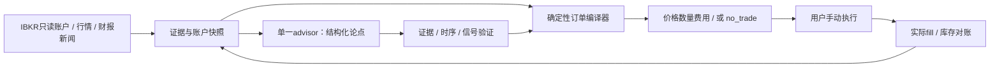

# Trading Agent：本地能力差距与证据、订单及效果验证架构

研究日期：2026-10-03。源码基线：`a20da36ae486160cb8acd47fdb7fe25714a6e0cf`。
本报告保留实施前的差距和设计判断；下文状态指上述基线，当前实现与验收见[实现记录](trading-skill-implementation-2026-10-03.md)。

本报告只审阅公开产品源码、示例配置、测试与一手资料；运行探针使用系统临时目录中的独立 SQLite 数据库。没有读取个人配置、账户状态、密钥或私人交易记录，没有改动实现。下文区分「已确认事实」「设计推断／建议」「待决定」。架构分析考察只读券商数据、手动交易、ETF 与美股个股、长期与波段模式、总回报及分派再投资，以及研究机会与确定性订单计算。本文件不记录任何具体账户的资产金额或持仓。

## 1. 结论

**已确认事实：项目已经具备可复用的证据快照、可审计成交账本、规则采用、资金与费用规划、整篮风控和历史建议隔离。它还没有 IBKR 账户同步、可成交实时买卖报价、个股研究到交易的完整入口，也没有两个投资模式共享账户资源的模型。** 当前能给出的精确数字主要是「依据完成交易日收盘价及手工现金输入计算的规则建议」，不能直接称为「当前券商可以买到的价格和数量」。

**设计建议：保留一个面向用户的 advisor，内部用研究模块产生结构化论点，经证据与信号验证，再交给确定性订单编译器。** AI 可以发现公司、提出可证伪的假设、选择已注册的定价／信号模板；机器计算最终限价、数量、费用、现金占用与组合风险。所有不足都必须能产生 `research_only` 或 `no_trade`，不以模型的文字自信补齐胜率、现金或报价。

这需要修订现有 [ADR-0004](../adr/0004-engine-computes-model-explains.md#L19)：现行「模型只解释或刹车」不能满足主动个股机会研究；修订后仍保留「订单数字只能来自确定性核心」这一不变量。下面是设计研究，尚未批准实现。

## 2. 当前代码实际能做什么

| 领域 | 已确认事实与源码 | 对目标的差距 |
|---|---|---|
| 标的身份 | [instruments.py](../../scripts/copilot/instruments.py#L24) 显式 ETF 白名单；[normalize_instrument](../../scripts/copilot/instruments.py#L54) 拒绝白名单外美股；指数仅研究 | 个股不能靠把 ticker 加进数组就获得合约、行情、风控、基本面与执行支持 |
| 成交与持仓 | [journal._normalize](../../scripts/copilot/journal.py#L230) 接受一般美股代码与 USD/share 的完成操作，金额为 Decimal 字符串；[持仓投影](../../scripts/copilot/journal.py#L298) 仅使用 executed，按账户、币种、单位分组 | 个股成交可以记账，个股研究入口仍拒绝；「能记录」不等于「能建议交易」 |
| 初始库存 | 现有持仓从 buy/sell 事件投影，卖超库存标 `opening_balance_required`；[coverage](../../scripts/copilot/journal.py#L708) 只声明已记录持仓完整 | 没有独立 opening inventory snapshot；当前持仓声明与历史成交事件混用会留下缺价格／日期的 pending |
| 现金与账户 | [示例配置](../../config/user.example.toml#L8) 明确现金手工填写；[service.evaluate](../../scripts/copilot/service.py#L456) 从配置取 cash；[journal context](../../scripts/copilot/journal.py#L548) 不提供现金账本或 buying power | 缺少 USD/AUD 等原币现金、未结算资金、未成交订单、负债、券商权限及余额时效；账户净资产不能替代可用现金 |
| 市场价格 | [Yahoo](../../scripts/copilot/providers.py#L258) 日线；[Alpaca](../../scripts/copilot/providers.py#L363) SIP 日线；[NasdaqEquity](../../scripts/copilot/providers.py#L512) 最近完成交易日单个收盘价 | 没有股票 bid/ask、size、实时 last、交易状态或订单簿适配器；HTTP `cache_status=live` 仅表示本次抓取 |
| 证据校验 | [collect_snapshot](../../scripts/copilot/market_data.py#L194) 要求 260–400 个完整日线；检查币种、单位、交易日、价格、上游独立性；最近对齐收盘价交叉核验 | 检验收盘价不等于核验全部历史 OHLCV；`swing` horizon 仍用日线，不提供盘中执行报价 |
| 财报与宏观 | [sec_company](../../scripts/copilot/research_data.py#L217) 将 companyfacts 与有 acceptance timestamp 的近期 filings 对齐；[enrich](../../scripts/copilot/research_data.py#L354) 已有 stock 路径 | 正常入口白名单使一般个股路径不可达；近期 filings 切片不是完整历史 point-in-time 财报库 |
| 规则与模型权限 | [evaluate_rule](../../scripts/copilot/policy.py#L813) 计算规则权重、费用后资金与订单；[MCP](../../mcps/copilot_mcp.py#L110) 只暴露 bounded brake | 不能把任意 AI 公司论点转换成已验证的候选选择和交易条件；需要新增结构化信号接口与治理 |
| 整篮一致性 | [policy](../../scripts/copilot/policy.py#L1086) 任一必要行受阻时清除可执行字段；[service](../../scripts/copilot/service.py#L528) 持久化篮子标记；[journal](../../scripts/copilot/journal.py#L660) 批量事务提交 | 可复用；但手动实际执行不会原子成交，卖出未确认前不能提前承诺其收入给买入 |
| 历史建议 | [service._recommendation_view](../../scripts/copilot/service.py#L114) 全部是 research_only，数量等移到 historical_order，requires_reevaluation=True | 正确保留；新 Agent 不应把记忆检索结果再次展示为当前可执行订单 |
| 风险与表现 | [valuation.observe](../../scripts/copilot/valuation.py#L16) 持仓／现金版本变化后开始新段；未知历史基线不伪造零回撤 | 缺少有日期的存取款、股息、费用、FX 与完整账户估值；当前段回撤不是全账户跨交易的真实收益曲线 |
| 实际券商接口 | 源码检索无 IBKR/Flex 客户端、positions、account summary、execution 回调或订单发送接口；[ADR-0005](../adr/0005-verified-data-constraints.md#L65) 明确未集成 | 当前 IBKR 是文档中的 intended path，不能宣称已同步账户或验证实时行情 |

### 已运行的两个最小反证

使用 `python -S -B -`、`TemporaryDirectory` 和公开 journal 接口，运行结果如下。数字与语句均是合成测试数据，与任何个人账户无关。

1. 记录 “I currently hold 7 shares of QQQ.”，即使 payload 标记 `execution_status=executed`，因缺真实成交确认、日期与价格，receipt 为 pending。随后对当前版本调用 coverage declaration，context 可以同时出现 `portfolio_complete=True`、`holdings=[]`、`pending_count=1`。
2. 完整合成 AAPL 成交记录 receipt 为 executed；同一程序 `get_instrument('AAPL')` 报「不在 ETF registry」。

第一项说明当前持仓导入的语义缺口，不能据此推断「每个 pending 都应该阻断 coverage」：无关研究意图可以 pending，但未解决的初始库存或现金差异必须进入 completeness 检查。第二项证明个股账本基础可复用，同时证明研究／交易能力还没开放。

## 3. 「真实价格、准确数量」应分成三种输出

1. **市场观察值**：某合约在某时点的 bid/ask/last/close；记录源、币种、单位、session、行情类型、发布时间／观察时间、抓取时间及有效期。
2. **当前有效的交易指令**：基于新鲜报价、账户快照、明确算法和券商规则计算的数量与 tick-valid 限价。限价约束可接受价格，不保证成交。
3. **实际成交值**：唯一 fill 的实际数量、价格、时间、账户、费用及货币。建议的数量或限价不允许变成该值。

当前 [service.collect](../../scripts/copilot/service.py#L71) 把研究快照有效期限制为 30 分钟，但这不会把上一交易日收盘价变为当前 ask。[policy 的 limit_price_basis](../../scripts/copilot/policy.py#L1060) 是 `split_adjusted_close`，应明确为规则计算基准；新执行报价必须使用对应合约的原始现价，拆股调整价与当前股份数量不可混用。

IBKR 官方区分 live、frozen、delayed、delayed frozen。live 需要对应权限；delayed 通常落后 15–20 分钟；frozen 是最后可用报价。成功返回数据不足以证明实时性。因此编译器必须读取实际 market data type，而非只检查 HTTP 成功或最近 retrieved_at。[IBKR market data types](https://www.interactivebrokers.com/docs/tws-api/doc/market-data-delayed/introduction)

**设计建议的 ExecutionQuote 最小字段**：contract/conId、symbol、primary exchange、currency、raw bid/ask、bid/ask size、last 与 last timestamp（可空）、quote observed_at（若源确有此字段）、received_at、market_data_type、session/trading status、source/feed/permission、market-rule identity、valid_until、evidence hash。无法证明 quote 的事件时间时，不伪造 `observed_at=received_at`，另标时效证据等级。last 成交价不能替代可买 ask 或可卖 bid。

为数日到数周的波段和长期建议设置不同研究刷新频率；**两者在生成实际买卖指令时都刷新报价和账户**。建议有效期应取报价、账户、研究条件及 session 规则的最早到期时间。有效期内出现新成交、提现、挂单、合约变更或关键证据变化，版本绑定即失效；手动点击前提示重新计算。精确 TTL 和允许的延迟行情等级仍须按用户接受的数据费用、市场时段与执行模板确定。

## 4. IBKR 账户与执行约束：先补实际输入

**已确认外部事实：** IBKR Account Summary 中 buying power、available funds、net liquidation value 含义不同。available funds 是按权益及初始保证金计算的账户指标；buying power 也不等于银行意义上的现金。不能把显示为基准币的账户总资产直接赋给 `investable_cash_usd`。[IBKR account summary](https://www.interactivebrokers.com/docs/web-api/api-reference/trading/trading-accounts/get-account-summary)

**设计建议：** 通过只读 IBKR adapter 构造一次可验证、带完成标记的账户快照，包括账户身份、原币 cash/settled cash、positions、已有 open orders、负债、可用资金、margin/cash 账户类型、交易权限、时间与覆盖范围。选择可用于该指令的保守资金上限，显式声明是否允许保证金、自动 FX、未结算售款；这些不能由 adapter 默许。AUD 基准净值可以用于展示总资产，USD 购买仍依据 USD 可用资金与已批准的换汇路径。

Flex 应主要承担报表导入与对账，实时账户状态／报价通过独立只读会话取得。当前官方 Flex 文档已经说明 report reference、生成等待、CSV/XML 等；用户 query 仍决定字段。ADR-0005 的「IBKR publishes no schema」不能继续当作当前外部事实。正确工程要求是选定最小 query，验证样本与缺字段、空账户、多币种、报表时间，而不是根据文档虚构该用户已有权限。[IBKR generated report](https://www.interactivebrokers.com/docs/web-api/api-reference/get-statement)

**费用事实：** 当前 `CostModel` 默认 `0.0035/share + minimum 1 USD + 2bp round-trip spread` 是近似模型；不是当前官方 US Tiered 的完整默认表。官网在低档股数下列 Tiered `0.0035/share、最低0.35 USD`，Fixed `0.005/share、最低1 USD`，并列明第三方费用。[本地 CostModel](../../scripts/copilot/backtest/engine.py#L70)、[IBKR stock commissions](https://www.interactivebrokers.com/en/pricing/commissions-stocks.php)

**设计建议：** 实盘建议使用账户费率计划、股票/市场、规模、spread、FX 成本构造保守成本估计，标出估计与实际费用。小账户波段需检查最小手续费、往返 spread 和换汇后的净收益门槛；收益空间不足时输出 no_trade。模型未校准的 confidence 不能作为胜率 `p`，不允许以此计算 Kelly。若展示 `p×平均盈利−(1−p)×平均亏损−费用`，p、盈亏分布必须来自独立验证样本并披露不确定性；否则仅展示成本与情景分析，不提供「正期望已验证」判断。

IBKR 的 `minTick` 只表示最小价格增量；不同价格区间／交易所可能需要 market rules。因此限价必须按当前合同规则舍入并重新验资金，而非固定保留两位小数。[IBKR ContractDetails](https://www.interactivebrokers.com/docs/tws-api/ref/contract-details)

IBKR 每个 partial fill 有独立 ExecId，execution price 不含 commission；费用报告用 execId 关联。当前 journal 的 external trade id、账户、幂等和修正可以复用，但没有完整的 order/cumulative-fill/remaining 生命周期。应逐 fill 对账、延迟关联费用，区分 correction、重复回调与重连补发，不能一次部分成交就记录整个建议成交。[IBKR Execution](https://www.interactivebrokers.com/docs/tws-api/ref/execution)、[CommissionAndFeesReport](https://www.interactivebrokers.com/docs/tws-api/ref/commission-and-fees-report)

## 5. 持仓导入、双模式与手动交易的一致性

### 5.1 初始持仓是库存快照，不是假定历史买入

**设计建议的 OpeningInventorySnapshot**：账户、合约、as_of、quantity、原币 currency、来源证据、明确用户确认、成本基础及其 known/unknown 状态。缺买入日期或成本不影响确认「此时确实有这些股份」，但不允许编造历史收益。与已有已完成交易对齐，冲突差额进入 reconciliation，不能直接叠加造成双计数。

coverage 应分别声明 positions、cash、open orders、obligations 的覆盖与时效；进一步检查未解决库存差异，而非将一个布尔字段等同「可精确配置账户」。broker 快照和 journal 发生差异时保留双方证据，先对账；不能把差额自动解释为用户买卖。

### 5.2 一个物理账户，两本逻辑账

**设计建议：** `long_term` 与 `swing` 是同一账户内资源归属，不是各自复制整个账户的两个 portfolio。每笔股份／lot 与现金分配明确归属；账户总约束在逻辑账之上统一检查。

- 两模式共享物理现金、margin、open-order 占用、合约持仓和总集中度。
- 未分配库存保留在账户总风险分母，不得从研究范围外消失。
- 波段不能出售长期已分配股份或重复占用同一笔 USD 现金，除非明确的资源转移规则允许并留审计记录。
- 股息、DRIP 碎股、转账、FX、费用与 corporate actions 进入原币账本；总回报基准采用同样的再投资假设，实际 DRIP 未成交前不能算已拥有新增股份。
- 现行整数股执行会拒绝碎股存量；未来 DRIP／碎股账户需要券商支持与 Decimal share 编译规则，不能截断现有库存。[当前 live 边界](../../scripts/copilot/policy.py#L813)

模式限额、转移优先级和冲突处理由用户定案。研究建议本身不应永久占用现金；若未来加入本地 reservation，必须有明确状态、到期及取消机制，并与券商 open orders 去重。

### 5.3 建议篮子不是实际成交篮子

现有原子建议提交值得保留，实际手动执行按已完成操作更新。买入若依赖卖出所得，应显示条件化步骤：卖出完成／资金可用 → 读新账户与报价 → 重算买入。不能用可能未成交的 sell 给无条件 buy funding；部分卖出后按实际可用资金重算，不沿用原 basket 数量。

用户确认「打算买」仍是 intent；确认「实际成交」才改变 holdings。read-only broker position snapshot 可以核验当前库存，独立的执行导入合同是否能代替人工确认须明确授权并修订相应记录语义；本研究不默认改变现行 CLAUDE.md 的成交确认要求。

## 6. 建议的深模块接口与数据流

下列接口是设计草案。保留单 advisor 对话，不重建十四代理系统；研究模块可以是普通工具／函数，输出统一结构。



| 公开接口 | 输入／输出 | 核心责任 |
|---|---|---|
| `acquire_context(request, clock)` | → DecisionContext 或缺口 | 封装数据源 adapter；返回 EvidenceBundle、AccountSnapshot、ExecutionQuote、ContractConstraints、ModeAllocation，全部带时间与版本 |
| `research(context, objective)` | → StructuredThesis[] | 候选公司、方向假设、持有周期、支持与反证 evidence IDs、失效条件、请求的已注册 template；不给最终 qty 或自由 target price |
| `validate_signal(thesis, evidence, selection_policy)` | → ValidatedSignal / ResearchHypothesis / Refusal | 身份、事实引用、时间、源独立性、模板可用性、候选选择规则；区分可查事实与未来收益假设 |
| `compile_plan(context, signal, execution_policy)` | → ActionPlan / NoTrade | 唯一计算方向、数量、限价、cost/cash plan、限制、过期及 conditional steps；绑定账户、quote、模板及策略版本 |
| `reconcile_actuals(report, expected_version)` | → committed receipt / discrepancy | 区分开仓库存、实际 fills、费用补记、修正、DRIP、FX、pending，保持幂等与审计历史 |

**StructuredThesis** 应至少有 instrument identity、mode/horizon、hypothesis、supporting/counter evidence、known risks、catalyst/deadline、invalidation、template request、选择理由与 alternative/no-trade。词语「低估」「即将突破」本身不是机器可执行信号。

**ValidatedSignal** 指「根据批准模板可复算的条件」；不意味着收益必然为正。携带 template/version、固定参数来源、signal cutoff、输入 hashes、信号值、适用范围与研究证据等级。AI 可提出新模板研究，但未验证模板不能直接编译可执行订单。

**ActionPlan** 至少携带 plan ID、account/mode/contract、direction、qty+unit、price+currency+basis、order type/TIF/session、quote reference、valid_until、estimated fees/FX、cash before/after/reserve、风险变化、basket scope、条件步骤与 revalidation requirements。任何失败时不在正常订单字段保留可被误用的数量；诊断候选保留于明确 research_only 的 proposed plan。

编译器需对全账户执行检查，再检查逻辑模式额度；必要输入未知时 fail closed。adapter 负责外部来源差异，业务核心不直接依赖 IBKR callbacks 或网页 schema。时钟、fixture account/quote 均可注入，使公开接口测试不依赖真实账户。

## 7. 个股开放与定价模板

**已确认事实：** 当前 ETF 单标的上限覆盖为 25%，correlation 在 ETF 情况下明确不适用；静态 sector 的 diversified 表示无法归入一个 sector，不是已测得分散。[policy limits](../../scripts/copilot/policy.py#L19)、[sector 注释](../../scripts/copilot/instruments.py#L71)

**设计建议：** 新个股 Instrument 必须解析到合约/交易所/币种/单位/calendar，校验可交易性与 corporate actions，补 sector 和全账户集中度。不能把个股继承成 ETF 的 25% 上限或 correlation 例外。无法查清合约、已有股份或估值时拒绝受影响订单；研究候选之外的现有持仓仍属于全账户风险。

价格由模板算，模型只能选择允许的模板并引用证据。例如：

| 模板候选 | 可复算输入 | 输出与限制 |
|---|---|---|
| 被动限价 | 新鲜原始 bid/ask、market rules、明确的最大追价参数 | tick-valid limit 与失效时间；无报价或 spread 异常则 no_trade；不许把 midpoint 称为保证成交价 |
| 回撤分批 | 已验证 raw bars、ATR 或窗口水平、固定参数 | 算法候选限价；先通过模板验证，再用当前报价/账户检查是否可以发指令 |
| 突破条件 | 截止决策前的窗口 high、可交易 session、固定触发／限价规则 | 条件式 stop/limit 研究计划；必须处理 gap、触发与未成交，不假设触价即完整成交 |
| 长期估值带 | PIT 财报、明确现金流假设／估值公式、情景与敏感性 | 研究估值区间；最终购买限价另按当前原始报价算，不把估值中心当实际市场价格 |

这些是待验证模板候选，不是本报告认可的盈利策略。每个模板的 free parameters、候选选取过程、成本和适用标的都应冻结。模板验证要求不能机械变成「每家公司都必须有十五年上市历史」，也不能以此跳过治理：新股可以被研究，历史不足要明确降低可验证范围或暂停相关执行信号。

数量计算应同时受可用原币资金减去 reserve/费用/承诺、模式预算、全账户集中度、允许持仓增量、流动性／单笔规模与交易单位约束；寻找满足约束的最大合法数量，重新算费用后检验 cash floor。若使用止损距离作风险 sizing，记录它是计划风险；隔夜跳空和无法成交仍可能使实际损失超过该值，不能当保证损失上限。

## 8. 验证：软件正确性与投资效果分别证明

### 8.1 公开接口与反证测试

先验证公开 facade 的真实路径，避免只测试实现的私有 helper。建议必须包含以下反证：

| 情景 | 期望可观察结果 |
|---|---|
| 初始库存缺成本，但当前数量明确；与已有成交重叠 | 可以确认当前库存，成本 unknown；冲突需对账，不编造旧成交或重复持仓 |
| coverage 已声明但存在未解决 opening inventory | affected execution 暂停，显示具体缺口 |
| 基准币 NAV、USD cash、AUD cash 不同 | 数量只用批准资金路径；不能把 AUD NAV 当 USD cash |
| 账户快照后提现／挂单／成交 | 原计划失效；资金减少不能使可买数量增加 |
| 两模式同时买或卖同一资源 | 全账户资金／股份占用唯一；冲突按显式规则处理 |
| sell 风控失败而 buy 依赖所得 | 全篮无无条件 buy；部分 sell 后必须重新定价与 sizing |
| 报价抓取时间新但 delayed/frozen/stale，或 bid>ask/halt | 不输出实时可执行指令，保留研究解释 |
| 同 ticker 但合约／币种不同；拆股后 adjusted level 与 raw quote 混用 | identity/basis 校验拒绝，qty/price 均不静默转换 |
| partial fills、重复、重连重放、成交修正与费用晚到 | 实际股份只变化一次，按 fill 对账，原事件保留 |
| 更换模型或来源文本夹带指令 | 不改变确定性编译器权限；无证据的数字不能过 gate |
| 新财报在 cutoff 之后发布，或宏观历史数值后来修订 | 不进入当时的 signal；可明确标无法证实历史 vintage |
| 手动计划过期或被 history 检索再次取出 | research_only；重新读取账户、quote 和 policy 后才有新计划 |

这些测试证明输入边界与资金一致性，不能证明交易胜率。温度为零或测试通过也不是投资有效性的替代指标。

### 8.2 冻结 point-in-time 研究

每次研究保存不可变 evidence body/hash、observed/published/accepted/available/received time 的已知精度、decision cutoff、合约、数据版本、模型/prompt/tool/template 版本、候选集合、选择理由、no-trade 与参数来源。候选池也须按当时可选范围冻结，保留退市／失败候选与当时 corporate actions，不用今天存活的成分股名单倒填历史。对缺 available_at 的源，明确不具备盘中发表瞬时回放的证据，而不是以交易所收盘时间填其 publication。

SEC APIs 随披露更新，submissions 与 XBRL 通常有不同处理延迟；accepted_at 不是机器已收到全部 companyfacts 的精确时刻。源只提供「当时受理时间」时，回放应保守处理传播延迟，并保存当次实际收到的内容。现有代码只关联近期可见 filings，不能声称覆盖全部历史 vintage。[SEC APIs](https://www.sec.gov/search-filings/edgar-application-programming-interfaces)

FRED 默认回答「今天对过去所知道的信息」；ALFRED realtime period 可取得过去日期已知版本。日级 vintage 仍不能被解释为精确到分钟的发布证据。[FRED real-time periods](https://fred.stlouisfed.org/docs/api/fred/realtime_period.html)

模型可能通过训练资料知道历史事件的后果，因此给现代模型一份删去未来字段的旧财报，不足以证明历史盲测。建议把既往回测作为算法与成本敏感性证据，将事先冻结版本的前瞻 shadow 记录作为 AI 研究有效性的关键检验；这是一项设计推断，不是对该模型训练内容的已确认事实。

### 8.3 执行、成本与基准

当前 [engine.run](../../scripts/copilot/backtest/engine.py#L190) 的信号包含 current bar，且 same-bar close 成交；这是显式披露的乐观执行假设。[execution_sensitivity](../../scripts/copilot/backtest/execution_sensitivity.py#L64) 冻结先前信号，在下一 common published row 的 close sizing/成交，是 research_only 且不能采纳，未建模 next-open、限价可达性、盘口、gap 或 partial fill。两者均不能直接声称复现实际手动成交。

新模板应规定最早可行动时点：资料可用、advisor 生成、用户读到／操作之后才观察执行价格。冻结的指令数量不能根据未来执行 close 重新优化；如果研究的是到时按权重再 sizing 的规则，应披露该行为。限价触及高低价不充分证明完整成交；数据只能支持区间时，报告保守成本／成交情景与未成交，不发明历史 fill。

比较至少包含：原有持仓继续持有、匹配风险和现金流的宽基／现金组合、简单确定性规则、规则加 AI brake、AI candidate 模板。全部使用相同资金、原币/FX、分派再投资、费用、执行时延与机会范围；样本选择不能只留下 AI 推荐的赢家。长期看净总回报／回撤／周转／成本，波段看净收益分布与执行成功，不以命中率独立替代盈亏比和尾部风险。

真实账户的存取款、分派、FX 和费用用于现金流调整后的账户绩效；未执行建议的反事实绩效另记，两者不混为一条曲线。当前 valuation 按持仓/现金版本分段，未来要补 dated cashflows 才能跨段核算，不能把追加资金算利润或因交易重置而宣称全历史无回撤。

### 8.4 多重试验与前瞻验证

现有 admission 要求跨度、危机年份、非零成本、少参数与 2019 起 holdout；[源码注释](../../scripts/copilot/backtest/admission.py#L32) 已明确：今天用 2019–2026 调参，再用该段验证并非真正 out-of-sample。对 AI 候选选择还要增加 prompt、模型、候选池、指标和多版本模板的 trial ledger，包括失败试验。

Deflated Sharpe Ratio 用样本长度、收益非正态特征及试验搜索等信息修正选优后的 Sharpe。不能把试过很多模型/提示词的过程填成「一个 trial」；相关试验的有效数量亦需假设和敏感性披露。[Bailey & López de Prado, DSR 原论文](https://www.davidhbailey.com/dhbpapers/deflated-sharpe.pdf)

CSCV/PBO 检查候选策略在多个样本划分中，经样本内选优后在样本外表现落后的概率。需要保存候选收益矩阵，不能只喂入最终赢家；它是过拟合诊断，不能代替按时间推进的验证，也不保证未来盈利。[Bailey 等, PBO/CSCV 原论文](https://www.davidhbailey.com/dhbpapers/backtest-prob.pdf)

设计上按时间做 expanding/walk-forward，并根据持有期处理重叠标签；每次版本变更重新标记研究与验证段。随后前瞻 shadow：事先锁定策略/参数/模型及评估窗口，完整记录 hold、拒绝、失效、未成交和候选淘汰，不在结果出来后改基准。paper 用于账户/行情/成交/费用流程演练；模拟结果只是模拟证据，仍需分离于真实成本和真实市场成交验证。所需时长、样本量和接受阈值应随策略频率与风险预算确定，不能承诺一个任意测试次数后「胜率可靠」。

## 9. 建议交付顺序与待决定项

**设计建议的最小顺序：**

1. IBKR 只读账户快照、开仓库存导入、原币 cash/权限/挂单对账；首先证明分母正确。
2. 一只已解析 US stock 的 raw quote 与 contract rules，打通从新鲜证据到 manual 指令的公开接口；先证明价格、币种、tick、fees 与 expiry。
3. 同账户长期／波段 allocation 与冲突规则；明确资金共享及卖后重算。
4. 结构化 thesis、一个可复算的 candidate/price 模板、证据验证和整篮编译；未验证机会留研究层。
5. 冻结 PIT signals、成本与执行敏感性、trial ledger、匹配基准及前瞻 shadow；验证发现与收益是否成立。

**仍待用户决定：**

- 全账户最大回撤、单标的/行业额度、波段模式总限额、单次计划风险以及长期/波段冲突优先级。
- 账户 cash/margin 的使用政策、是否允许自动 FX 或未结算资金、原币现金与允许投入资金的确认方式。
- IBKR 数据权限和愿意承担的行情费用；能取得哪种实时报价、历史数据与账户 API。当前报告没有测试该私人账户权限。
- 盘前/盘后是否参与、限价模板、有效期、手动执行后如何反馈 fill/partial fill/费用。
- 个股机会选择范围、研究/交易证据等级和验证接受标准；新个股主动研究须正式修订 ADR 与策略采用身份，而非沿用 schema3 的 ETF 回测结果。

IBKR、manual、中长期为主以及 AI 研究+规则计算已经确认；不需要把这些重新作为悬而未决问题。实际可用现金和风险额度仍未由本研究核实，不应据账户总资产推算。

## 10. 本次验证边界与复核方法

本次完成：固定 HEAD；阅读核心、适用 ADR/CONTEXT 和相关测试合同；公开源码检索；两个 stdlib/Temp DB 真实 journal 探针；核验所引 IBKR、SEC、FRED 官方文档与原论文。未运行真实券商连接、订阅行情、私人账户读取或下单；未进行策略收益实验。报告中的 proposed interfaces/templates 均是设计推断。

可复核入口（从项目根运行；只读取公开文件）：

```powershell
git rev-parse HEAD
rg -n "ETF_REGISTRY|def normalize_instrument" scripts/copilot/instruments.py
rg -n "def record_operation|def record_coverage_declaration|def get_context" scripts/copilot/journal.py
rg -n "Flex|IBKR|buyingPower|availableFunds|execDetails|reqPositions" scripts mcps config/user.example.toml
rg -n "execution_price|signal_cutoff|disclosures" scripts/copilot/backtest/engine.py scripts/copilot/backtest/execution_sensitivity.py
```

最小 Temp 探针的核心代码如下；调用者必须保留 db_path，不能省略为默认个人数据库。

```python
import sys
import tempfile
from pathlib import Path
sys.path.insert(0, str(Path.cwd() / 'scripts'))
from copilot import journal
from copilot.instruments import get_instrument

with tempfile.TemporaryDirectory() as folder:
    db = Path(folder) / 'audit.sqlite3'
    receipt = journal.record_operation({
        'statement': 'I currently hold 7 shares of QQQ.',
        'source_message_id': 'synthetic-opening',
        'execution_status': 'executed', 'instrument_id': 'QQQ',
        'side': 'buy', 'quantity': '7', 'unit': 'share', 'currency': 'USD',
    }, 'synthetic-opening-key', db_path=db,
       now='2026-10-03T00:00:00+00:00')
    current = journal.get_context(db_path=db)
    journal.record_coverage_declaration(
        sleeve='etf', base_currency='USD',
        portfolio_version=current['portfolio_version'], db_path=db)
    current = journal.get_context(db_path=db)
    assert receipt['status'] == 'pending'
    assert current['portfolio_complete'] and not current['holdings']
    assert len(current['pending_operations']) == 1

with tempfile.TemporaryDirectory() as folder:
    db = Path(folder) / 'audit.sqlite3'
    receipt = journal.record_operation({
        'statement': 'I bought 1 share of AAPL at 100 USD on 2020-01-02.',
        'source_message_id': 'synthetic-stock', 'execution_status': 'executed',
        'instrument_id': 'AAPL', 'side': 'buy', 'quantity': '1', 'unit': 'share',
        'price': '100', 'currency': 'USD', 'occurred_at': '2020-01-02', 'fees': '0',
    }, 'synthetic-stock-key', db_path=db,
       now='2026-10-03T00:00:00+00:00')
    assert receipt['status'] == 'executed'
    try:
        get_instrument('AAPL')
    except ValueError:
        pass
    else:
        raise AssertionError('Individual stock unexpectedly resolved')
```

可复用的安全工程基础已经存在，下一阶段的关键成果应是可核验账户与 quote、可复算候选与订单、可证伪的前瞻效果记录。测试数量、研究文本长度或模型 confidence 都不构成投资盈利证明。
